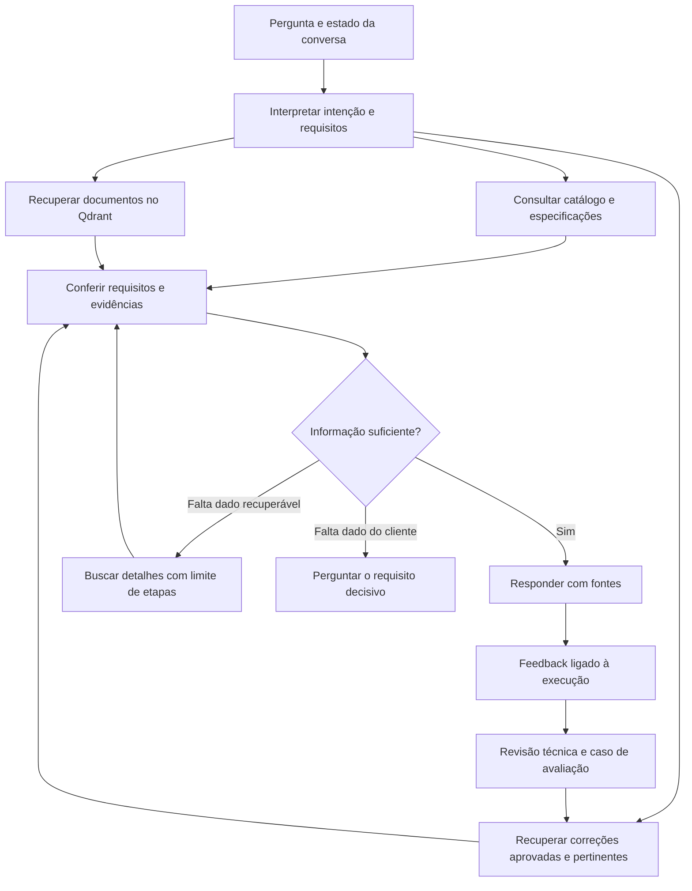

# Avaliação do projeto e evolução da qualidade do agente

Data: 10/09/2026.

## Conclusão

O projeto já possui fundamentos úteis: catálogo no Qdrant, recuperação por código/texto/vetor, consultas numéricas, histórico persistente, permissões no backend, aprovação de documentos e backend de conhecimento curado. A evolução recomendada é transformar erros em dados de avaliação e correções contextualizadas, e transferir decisões verificáveis do prompt para consultas e validações estruturadas.

Não há evidência nesta análise de que trocar o banco vetorial ou o modelo de embedding seja necessário. O nome `COLLECTION_NAME=pu_products_catalog` apenas seleciona a coleção; não controla a qualidade do raciocínio.

## Escopo e limites

Análise da estrutura do repositório, documentação, configuração e fluxos principais de frontend, API, recuperação, ingestão, ferramentas, treinamento, histórico e permissões. Inspeção mais profunda do caminho que produz respostas e dos testes relacionados. Não é uma auditoria exaustiva de segurança nem uma medição da precisão do acervo em produção. Não foram executadas ingestões, migrações ou alterações de dados. O único arquivo de projeto criado nesta avaliação é este relatório.

Foram executados oito arquivos de testes existentes: `test_spec_search`, `test_rag_retrieval`, `test_doc_sections`, `test_catalog_stats`, `test_recommendation_guardrails`, `test_tool_calling_sequence`, `test_licoes_aprendidas` e `test_retrieval_failure_handling`.

Resultado: **144 passaram e 1 falhou**. A falha de `test_match_retorna_503_quando_catalogo_esta_indisponivel` ocorreu ao tentar acessar PostgreSQL no endereço isolado configurado para esta análise; esse teste não ficou independente do banco. Isso não demonstra falha do endpoint em produção. Surgiram avisos de incompatibilidade entre o cliente Qdrant local 1.19.0 e servidor 1.9.2, enquanto `requirements.txt` restringe o cliente a `>=1.9.0,<1.10.0`. Portanto o ambiente local também não reproduz integralmente as dependências declaradas.

Os testes exercitam comportamentos programados, com simulações de dependências em boa parte dos casos. Não demonstram a taxa de acerto de um LLM real sobre o catálogo completo.

## Achados principais

### 1. O caminho para corrigir sem programar existe no backend, mas falta na tela

Evidência: `backend/app/treinamento_router.py`, `treinamento_service.py`, `rag/treinamento.py` e `frontend/app.py:378`.

Existem cadastro de correção/conhecimento/exemplo, aprovação e consulta à coleção separada `pu_treinamento`. O frontend atual apenas envia útil/não útil, pergunta, resposta, modelo e fontes. Não oferece comentário nem cadastro/aprovação de treinamento. O próprio cronograma registra que falta a tela.

Consequência: o mecanismo mais próximo do objetivo do usuário ainda não está disponível no fluxo cotidiano. Um polegar negativo sinaliza insatisfação, mas não explica qual fato está errado ou qual seria a resposta correta.

Recomendação: concluir a interface existente e ligar cada correção à resposta que a originou. Solicitar opcionalmente motivo, informação correta e fonte; manter aprovação para fatos técnicos compartilhados. Correção deve ter escopo de produto, aplicação, condições e documento quando aplicável. Trata-se de memória consultável, não alteração dos pesos do modelo.

### 2. Feedback recente é tratado como se fosse relevante

Evidência: `backend/app/feedback_service.py:46` e `rag/engine.py:753`.

Na versão avaliada, `obter_licoes_de_feedback(limit=5)` selecionava os cinco últimos negativos globalmente, sem medir relação com a pergunta atual. Essa injeção foi removida: agora somente correções escritas, aprovadas e recuperadas por similaridade entram no contexto do agente.

Consequência: uma reclamação sobre embalagem pode aparecer numa consulta sobre densidade; correções úteis desaparecem dessa janela quando chegam cinco feedbacks novos. Sem comentário, o modelo só sabe que alguém não gostou de alguma resposta àquela pergunta.

Recomendação: usar feedback bruto como sinal para análise; usar como orientação factual apenas correções revisadas e relevantes, aproveitando a infraestrutura de treinamento. Não promover texto livre de feedback a instrução de sistema. Aplicar permissões também ao conhecimento recuperado.

### 3. Busca híbrida existe, mas a seleção ainda é heurística

Evidência: `backend/app/rag/engine.py:458`.

A ordem é seção, código, palavras-chave e vetor. A busca semântica pede seis resultados por padrão, descarta os scores e não estabelece um corte de relevância. Resultados prioritários podem ultrapassar seis e ocupar todo o contexto disponível para complementos semânticos. Os lotes por palavras-chave vêm de `scroll`, depois recebem uma pontuação local por ocorrência.

Recomendação: preservar IDs e scores, reunir candidatos, remover duplicatas por identidade estável do documento e reordenar pela relevância à pergunta. Comparar, por exemplo, 20–40 candidatos com 6–10 evidências finais; esses números são pontos de partida para experimento, não parâmetros já validados. Código exato e restrições técnicas continuam sendo condições explícitas. Um score vetorial não deve ser apresentado como probabilidade de acerto.

O Qdrant documenta busca híbrida e reordenação em etapas. A Query API foi introduzida na versão 1.10, posterior à imagem 1.9.2 deste projeto. Pode-se começar reordenando na aplicação; usar a API atual exige planejar atualização compatível de servidor e cliente. Fontes: [busca híbrida](https://qdrant.tech/documentation/search/hybrid-queries/), [histórico da Query API](https://qdrant.tech/course/essentials/day-3/hybrid-search/).

### 4. Requisitos técnicos não formam uma consulta composta

Evidência: `backend/app/rag/spec_search.py:651` e `:851`.

O interpretador automático seleciona a primeira propriedade reconhecida e devolve um único critério. Reprodução local: `densidade de 35 kg/m3 e dureza Shore A 80` devolveu apenas densidade, valor 35, tolerância de 5%. O LLM ainda recebe a pergunta completa, mas o filtro automático não garante o atendimento simultâneo dos requisitos.

A busca numérica varre os trechos e extrai especificações durante cada consulta. A unidade é exibida nos resultados, mas a interface de busca não recebe uma unidade para impor compatibilidade dimensional geral; tempos têm normalização específica. A preferência documental ocorre entre candidatos que já atenderam ao critério, portanto não resolve por si só conflito entre boletim de referência e laudo de lote.

Recomendação: representar uma lista de requisitos com propriedade, operador, valor, unidade, condição de ensaio e obrigatoriedade. Consultar sua interseção sobre dados estruturados. Diferenciar explicitamente “atende”, “não atende” e “não informado”. Não tratar densidade do líquido como equivalente à densidade da espuma, nem Shore A como Shore D. Selecionar a referência documental válida antes de declarar atendimento.

**Implementado em 11/09/2026:** múltiplos requisitos são interpretados e intersectados em uma única varredura; limites exigem a faixa inteira compatível, propriedade ausente não conta como atendimento e consultas compostas são respondidas diretamente pelo resultado estruturado, sem redação do LLM.

### 5. O agente tem uma rodada de ferramentas, não uma investigação iterativa

Evidência: `backend/app/rag/engine.py:842–883` e `:963–1008`.

O modelo pode pedir várias ferramentas inicialmente. Depois de executá-las, a chamada final não recebe ferramentas. Ele não pode usar um resultado para decidir uma segunda busca, nem corrigir argumentos com uma nova chamada, apesar de algumas mensagens de erro sugerirem tentar novamente.

Recomendação: execução limitada por etapas, orçamento e tempo: buscar candidatos, consultar detalhes dos candidatos, verificar requisitos, responder ou pedir uma informação decisiva. Começar com duas ou três rodadas máximas e medir latência/custo. Não há necessidade de múltiplos agentes para obter esse benefício.

### 6. Há exceções locais e templates que pressionam por uma recomendação

Evidência: `backend/app/rag/engine.py:127`, `:236`, `:279`; `backend/app/templates.py`.

Existem tratamento específico para listagem de elastômeros, exclusões ADT/CAT e substituições de frases sobre estoque. O template comercial já começa com “Temos o produto ideal para sua demanda!”, e o completo contém estados exemplificados como “Atende” e “Homologado”. Isso pode tensionar as instruções de só afirmar fatos comprovados.

Recomendação: generalizar classificação de produtos e regras de compatibilidade em dados verificáveis. Escolher a apresentação conforme o resultado da análise: candidato comprovado, comparação inconclusiva, ausência de informação ou pedido de esclarecimento. Um modelo pode redigir, mas não deve inventar o estado de conformidade para preencher o template.

### 7. A ingestão perde estrutura relevante do documento

Evidência: `backend/app/rag/ingestion.py:75`, `:198`, `:345`.

PDFs são convertidos em texto; DOCX acrescenta tabelas depois dos parágrafos; o particionamento usa 700 palavras com sobreposição de 120 e elimina a estrutura de espaços. O payload contém arquivo, caminho, índice, conteúdo e sensibilidade. Não inclui página, revisão, identidade explícita do produto ou propriedades normalizadas. Não há OCR nesse caminho. Arquivos `.doc` também são encaminhados a `python-docx`, o que não equivale a suporte ao formato Word binário legado.

Recomendação: medir falhas de extração, preservar páginas/seções/tabelas e extrair dados estruturados na ingestão, com referência ao trecho original e revisão. Acrescentar campos progressivamente ou criar um índice complementar de produtos no PostgreSQL. Mudanças na extração ou divisão de trechos exigem reprocessar documentos afetados; melhorias em memória, avaliação e orquestração podem aproveitar os vetores atuais.

### 8. Menção textual ainda pode virar classificação de produto

Evidência: `backend/app/rag/catalog_stats.py:228`.

Na listagem por aplicação/tipo, a regra geral procura o termo no conteúdo. Há comprovação especializada para elastômeros, mas ela não constitui uma classificação geral do catálogo. Contagens dependem também de identificar produtos pela estrutura do caminho do arquivo.

Recomendação: catálogo estruturado com `product_id`, família, natureza, aplicações comprovadas e respectivas fontes. Separar “menciona determinada aplicação” de “tem aplicação comprovada”. Conservar a possibilidade de resultados desconhecidos e revisão humana das classificações ambíguas.

### 9. Histórico e fontes ajudam, mas não explicam por que uma resposta falhou

Evidência: `backend/app/conversation_service.py`, `models.py` e `rag/engine.py:344`, `:831`, `:889`.

Há histórico persistido; o modelo recebe as últimas oito mensagens. A reformulação da busca depende de pronomes e padrões específicos de rejeição. As fontes retornadas pelo motor são nomes dos arquivos inicialmente recuperados, sem comprovação por afirmação nem consolidação das evidências de ferramentas. Não encontrei um registro persistente de execução contendo scores, contexto final, versões, critérios e resultados de ferramentas.

Recomendação: manter estado explícito da demanda — produto, aplicação, requisitos e exclusões — e registrar um identificador de execução. Guardar evidências autorizadas, rota, chamadas, versões, latência e consumo, sem segredos. Associar feedback a esse registro. Uma explicação de auditoria deve mostrar dados e decisões verificáveis, não solicitar raciocínio interno do modelo.

### 10. A confiabilidade operacional precisa acompanhar a memória

Evidência: `backend/app/rag/treinamento.py`, `treinamento_service.py`, `backup.py`, `docker-compose.yml`, `config.py`.

O índice de treinamento não recebe filtro de permissão na busca. A remoção captura qualquer exceção, e a leitura usa o índice sem reconferir o status no PostgreSQL: falhas de sincronização podem manter um item revogado recuperável. Aprovação envolve dois bancos sem transação compartilhada. O backup vetorial padrão contempla a coleção configurada do catálogo, não automaticamente `pu_treinamento`; o PostgreSQL preserva os registros curados, mas falta um fluxo explícito de reconstrução do índice.

Recomendação: restringir treinamento compartilhado a conteúdo autorizado para sua audiência; reconciliar status entre bancos e criar uma reconstrução do índice a partir do PostgreSQL. Incluir a coleção ou sua reconstrução no ensaio de restauração. As portas de Qdrant e PostgreSQL estão publicadas no Compose e a validação do certificado LDAP está desativada por padrão; verificar a implantação real antes de concluir sobre exposição. São itens operacionais adicionais, não a causa demonstrada das respostas sem sentido.

## Arquitetura proposta

Exemplo: “produto para assento de ônibus, densidade 35, com requisito antichama”. A recuperação localiza documentos sobre a aplicação; a consulta estruturada verifica densidade e condições; a verificação procura evidência da norma exigida. Se faltar evidência, a resposta deve distinguir candidato plausível de homologação comprovada. Se a norma não tiver sido identificada, pode ser necessário perguntar qual é exigida. Um texto semanticamente próximo não substitui essas verificações.

## Ordem recomendada

| Etapa | Entrega | Como verificar o ganho |
|---|---|---|
| 1 | Registro de execução e conjunto inicial de 30–50 perguntas reais revisadas | Identificar se cada erro veio da extração, busca, interpretação, ferramenta ou redação |
| 2 | Tela de correções/aprovação e substituição do feedback global por memória relevante | Correção aprovada ajuda casos equivalentes e não altera casos incompatíveis |
| 3 | Requisitos compostos, catálogo estruturado e estados de evidência | Nenhum requisito obrigatório é ignorado; informação ausente não vira aprovação |
| 4 | Reordenação de candidatos e investigação limitada | Melhor recuperação dos documentos esperados, com custo/latência medidos |
| 5 | Melhorias de extração, versões e cobertura do acervo | Menos propriedades trocadas ou sem fonte; documentos afetados reprocessados de forma controlada |

As etapas 1 e 2 formam um primeiro pacote pequeno e útil. A avaliação deve começar antes da mudança da busca para permitir comparação. Não é necessário concluir toda a arquitetura para oferecer correção pela tela.

## Como medir a melhoria

O conjunto inicial deve conter perguntas por código, aplicações descritas em linguagem comercial, propriedades múltiplas, unidades diferentes, produto inexistente, ausência de evidência, documentos conflitantes, continuação de conversa, rejeição de candidato e acesso por perfil.

Para cada caso, registrar documentos esperados, fatos obrigatórios, afirmações proibidas e quando o agente deve perguntar ou admitir ausência de informação. Reservar parte dos casos e variações para avaliação, sem transformá-los todos em exemplos de treinamento; assim se mede generalização, não memorização.

Medir separadamente: recuperação da fonte esperada, atendimento de requisitos, sustentação das afirmações, perguntas de esclarecimento adequadas, latência e custo. Avaliação automática por outro LLM pode auxiliar, mas valores, códigos, unidades e permissões precisam de verificações determinísticas e amostragem técnica humana. O Ragas oferece métricas distintas para contexto, relevância da resposta e fidelidade às evidências: [documentação das métricas](https://docs.ragas.io/en/stable/concepts/metrics/available_metrics/).

Uma correção aceita deve gerar um caso de regressão e, quando pertinente, uma memória curada. Um erro de recuperação deve motivar ajuste da recuperação; um erro factual no documento deve motivar correção do documento. Alterar o prompt é apropriado para instruções de comportamento, mas não deve ser a solução padrão para todas essas causas.

## Decisão sugerida

Manter Qdrant e os vetores existentes. Começar com avaliação, rastreabilidade e conclusão do fluxo de correção pela interface. Em seguida, melhorar decisões técnicas e recuperação com base nos erros medidos. Comparar modelos usando os mesmos casos somente depois de conseguir distinguir esses fatores. Não iniciar por fine-tuning nem por uma reescrita geral: o código já mostra lacunas concretas em dados, ferramentas e feedback que um modelo diferente não garante resolver.
