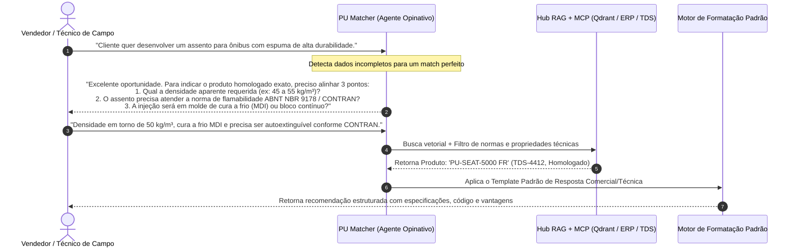
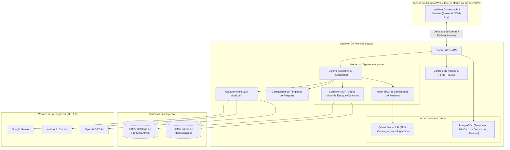

# 📑 Proposta de Projeto: PU Matcher & Technical Sales Copilot
## Agente Investigativo e Consultivo para Match de Produtos e Suporte Técnico Comercial em Poliuretanos

---

## 1. Sumário Executivo

Na indústria química de poliuretanos (PU), a equipe comercial técnica e os consultores de aplicação em campo recebem diariamente demandas complexas de clientes para o desenvolvimento ou substituição de produtos (ex.: *assentos para ônibus e transporte coletivo, espumas de colchão de alta resiliência, isolamento térmico para refrigeração, solados e elastômeros para calçados de segurança, filtros industriais*).

Muitas vezes, a empresa **já possui em seu histórico centenas ou milhares de produtos, boletins técnicos (TDS), formulações aprovadas e laudos de homologação** que atendem perfeitamente à necessidade do cliente. Porém, por falta de visibilidade rápida ou especificações incompletas trazidas do campo, inicia-se um processo demorado e custoso de "reinventar a roda" no laboratório.

O **PU Matcher** é um Agente de IA Consultivo e Investigativo on-premise que:
1. **Entrevista o Vendedor/Técnico de Campo:** Questiona de forma opinativa e proativa para entender o contexto real da aplicação, requisitos normativos e restrições de processo.
2. **Localiza Produtos Similares ou Idênticos:** Cruza as características solicitadas com todo o acervo histórico de produtos acabados, fichas técnicas (TDS) e homologações da empresa.
3. **Gera Respostas Padronizadas e Parametrizáveis:** Formata a recomendação final em um padrão corporativo oficial (comparativo de propriedades, normas atendidas, código do produto existente e benefícios).
4. **Preserva a Infraestrutura On-Premise:** Mantém o acervo confidencial dentro do servidor da empresa, com governança de perfis de acesso (**RBAC**), gateway **Multi-LLM** e integração **MCP / APIs**.

---

## 2. Dinâmica Operacional do Agente Opinativo

Diferente de um assistente passivo, o **PU Matcher** atua como um consultor sênior em vendas técnicas:



---

## 3. Escopo Funcional do Sistema

### 🔹 Módulo 1: Agente Opinativo & Investigador de Requisitos
* **Comportamento Proativo:** Analisa a solicitação inicial e detecta lacunas técnicas essenciais para a química de PU.
* **Perguntas Contextuais Inteligentes:** Questiona sobre:
  * Propriedades físicas (densidade, dureza Shore/IFD, resiliência, deformação permanente);
  * Exigências normativas (antichama/flamabilidade, resistência a intempéries, atoxidade);
  * Processo do cliente (máquina de alta vs baixa pressão, tempo de ciclo, temperatura de molde, cura a frio vs quente).
* **Sugestões Opinativas:** Opina sobre alternativas técnicas viáveis caso o cliente peça combinações incompatíveis na química de PU (ex.: altíssima resiliência combinada com densidades ultrabaixas).

### 🔹 Módulo 2: Motor de Match & Busca de Produtos Similares
* **Varredura no Acervo Corporativo:** Pesquisa em milhares de Boletins Técnicos (TDS), Catálogos de Vendas, Laudos de Homologação e Fórmulas de Linha.
* **Cálculo de Similaridade Técnica:** Identifica produtos idênticos já em catálogo ou o produto mais próximo (*base formulação*), indicando o percentual de aderência à demanda do cliente.
* **Checagem de Status Comercial (via MCP / ERP):** Verifica em tempo real se o produto recomendado está ativo para venda e tem matéria-prima em estoque.

### 🔹 Módulo 3: Parametrizador de Templates de Resposta
* **Padronização Corporativa:** O gestor pode definir e alterar os templates de resposta do agente conforme o público-alvo:
  * *Template 1: Resumo Comercial Rápido* (Ideal para mensagem de WhatsApp / e-mail rápido para o cliente com código e vantagens).
  * *Template 2: Proposta Técnica Preliminar* (Ficha comparativa completa: Requisito do Cliente vs Especificação do Produto Existente).
  * *Template 3: Parecer de Aplicação Interno* (Para encaminhamento à equipe de Engenharia de Aplicação/P&D).
* **Campos Obrigatórios Configuráveis:** Garantia de que toda resposta contenha: Código do Produto, Nome Comercial, Propriedades Principais, Normas Atendidas e Orientações de Processo.

### 🔹 Módulo 4: Hub de Ingestão de Dados (RAG Híbrido)
* Ingestão contínua de PDFs, DOCX e planilhas contendo catálogos de produtos, fichas de especificação técnica e históricos de homologação.
* Preservação estruturada de tabelas de propriedades mecânicas e físico-químicas.

### 🔹 Módulo 5: Conectores Vivos via MCP (Model Context Protocol) & APIs
* **MCP Server - Catálogo & ERP:** Consulta códigos de produtos ativos, status de linha e preços/disponibilidade.
* **MCP Server - Normas & Homologações:** Consulta banco de laudos de atendimento a normas (ABNT, ASTM, FMVSS, UL94, etc.).
* **Sincronização SharePoint / OneDrive:** Atualização automática de novos boletins comerciais publicados pela empresa.

### 🔹 Módulo 6: Governança, RBAC & Multi-LLM On-Premise
* **Perfis de Acesso:**
  * **Vendedor Externo / Representante:** Acesso a produtos de linha, TDS comerciais e comparativos. Sem acesso a custos industriais detalhados ou fórmulas sigilosas.
  * **Engenheiro de Aplicação / Vendas Técnicas:** Acesso a histórico de homologações e parâmetros de processo recomendados.
  * **Gestor Comercial / P&D:** Acesso total, incluindo parametrização de templates e novos produtos experimentais.
* **Gateway Multi-LLM Plugável (LiteLLM):** Flexibilidade para operar com Google Gemini, OpenAI GPT-4o, Claude 3.5 Sonnet, Grok ou LLMs locais.

---

## 4. Arquitetura da Solução On-Premise



---

## 5. Matriz de Perfis e Permissões (RBAC)

| Perfil de Usuário | Catálogo & TDS de Linha | Laudos de Homologação | Configuração de Templates | Visualização de Custos |
| :--- | :---: | :---: | :---: | :---: |
| **Vendedor / Representante** | ✅ Total | ✅ Sumarizado | ❌ Apenas Seleção | ❌ Bloqueado |
| **Técnico de Aplicação** | ✅ Total | ✅ Completo | ❌ Apenas Seleção | ⚠️ Opcional |
| **Gestor Comercial** | ✅ Total | ✅ Completo | ✅ Criação e Edição | ✅ Liberado |
| **Químico / P&D** | ✅ Total | ✅ Completo | ✅ Criação e Edição | ✅ Liberado |
| **Administrador TI** | ✅ Total | ✅ Total | ✅ Total | ✅ Total |

---

## 6. Exemplo de Template Parametrizado de Resposta

O gestor comercial pode cadastrar padrões como este no sistema:

```markdown
🎯 **RECOMENDAÇÃO TÉCNICA COMERCIAL - PU MATCH**

• **Demanda do Cliente:** {resumo_demanda}
• **Produto Recomendado:** **{nome_produto}** (Código: `{codigo_erp}`)
• **Família Química:** {familia_sistema} (ex: Sistema MDI Moldado a Frio)

📊 **Comparativo Técnico:**
| Parâmetro Requerido | Especificação do Produto Existente | Status |
| :--- | :--- | :---: |
| Densidade: {req_densidade} | {prod_densidade} | ✅ Atende |
| Dureza: {req_dureza} | {prod_dureza} | ✅ Atende |
| Norma: {req_norma} | Homologado conforme {prod_norma} | ✅ Certificado |

💡 **Diferenciais e Dicas de Aplicação:**
{pontos_fortes_e_processamento}

⚠️ **Observação Técnica:**
Produto de linha disponível. Recomendamos solicitação de amostra de 20kg para validação no molde do cliente.
```

---

## 7. Resultados Esperados & Benefícios

* **Aumento de Conversão em Vendas:** Respostas técnicas imediatas e fundamentadas diretamente durante a visita ao cliente.
* **Eliminação de Retrabalho em P&D:** Redução drástica de solicitações de "novos desenvolvimentos" para produtos que a empresa já fabrica.
* **Padronização da Comunicação Comercial:** Todas as propostas e indicações seguem o mesmo rigor e identidade visual técnica da empresa.
* **Segurança e Confidencialidade:** Todo o histórico de produtos e dados de clientes permanece isolado no servidor on-premise.
